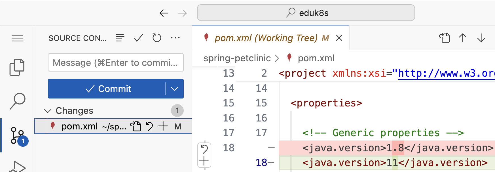
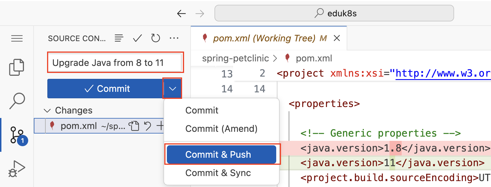

#### Sample Application

To discover the capabilities of *Spring Application Advisor*, we will use a well known application: [Spring Petclinic](https://github.com/spring-projects/spring-petclinic).
*Spring PetClinic* is a sample application designed to show how the Spring stack can be used to build simple, but powerful database-oriented applications. It demonstrates the use of Spring Boot with Spring MVC and Spring Data JPA.

*Spring PetClinic* is constantly upgraded to the latest versions, so we go back in time and check-out a version from around two years ago when it was still **based on Spring Boot 2.7 and Java 8**.

```execute
git clone :///spring-petclinic && cd spring-petclinic
```

```editor:open-file
file: ~/spring-petclinic/pom.xml
description: Open Maven POM to see used Spring Boot and Java version
line: 1
```
```editor:select-matching-text
file: ~/spring-petclinic/pom.xml
text: "<version>2.7.18</version>"
```
```editor:select-matching-text
file: ~/spring-petclinic/pom.xml
text: "<java.version>1.8</java.version>"
```

The Spring Boot migration from Spring Boot version 2.7 to 3.x (and Spring Framework 6) is challenging due to baseline changes to **Java 17+**, and **Jakarta EE 9+**.
Without a *VMware Spring Enterprise* subscription, [Spring Boot 2.7 is end of support](https://spring.io/projects/spring-boot#support) since 11/2023, which means that no new security fixes will be released as open-source.

Let's run *Spring PetClinic* to validate that it works before our upgrade.
```terminal:execute
command: cd spring-petclinic && ./mvnw spring-boot:run
session: 2
```

When the application has started, click here to open a new browser tab with the running application.
```dashboard:open-url
url: ://petclinic-.
```

Kill the application.
```terminal:interrupt
session: 2
```

#### Running our first upgrade step

*Spring Application Advisor*'s native CLI is called **advisor** and is available for all common operating systems.

Let's start by exploring the available commands.
```execute
advisor --help
```

As you can see, it supports the `build-config`, `upgrade-plan`, `mapping`, and `advice` commands. In this workshop, we will focus primarily on the upgrade workflow.

##### Produce a build configuration
The first step in the upgrade process is to produce a **build configuration** for *Spring Application Advisor* using the `build-config get` command. This generates a file containing the dependency tree (in CycloneDX format), the Java version required to compile the sources, and the build tool versions.
```execute
advisor build-config get --help
```
You may have already noticed that our sample application contains configurations and wrappers for both Maven and Gradle. With the `--build-tool` option, you can select your preferred one for the upgrade. In our case, the default `mvnw` (Maven wrapper) works fine since we are already in the root of our sample application.
```execute
advisor build-config get
```

Let's have a look at the generated build configuration.
```editor:open-file
file: ~/spring-petclinic/target/.advisor/build-config.json
```

##### Analyze an upgrade plan

With the information in the generated build configuration, *Spring Application Advisor* can compute the **upgrade plan**. The upgrade plan shows which Spring dependencies need to be upgraded and in what order.
```execute
advisor upgrade-plan get
```

##### Apply an upgrade plan from your local machine
Now it's time to run our first upgrade step with the `advisor upgrade-plan apply` command.
Let's look at the available options first.
```execute
advisor upgrade-plan apply --help
```

Some important options to be aware of:
- `--after-upgrade-cmd`: Automatically runs a Maven goal or Gradle task after the upgrade (we will use this later)
- `--build-tool-jvm-args` and `--build-tool-options`: Allow tweaking the JVM and build tools for larger code bases (e.g., increasing memory limits)
- `--push`: Automatically creates a remote branch, pushes the changes, and opens a pull request
- `--squash`: Combines multiple upgrade steps into one (we will explore this later)
- `--force`: Executes the full upgrade plan in one go
- `--from-yml`: References a `.spring-app-advisor.yml` file for enabling continuous upgrades in CI/CD

For now, we will run the steps locally without the `--push` option, as pull requests require a Git provider like GitHub, GitLab, or Bitbucket.

The first step of our upgrade plan is to **upgrade Java from 8 to 11**.
Since some of the latest recipes require Java 17 to be executed, let's set it for the terminal where we run the advisor CLI.
```terminal:execute
command: sdk use java $(sdk list java | grep -E 'installed|local only' | grep '17.*[0-9]-librca' | awk '{print $NF}' | head -n 1)
session: 1
```

Let's run the upgrade!
```execute
advisor upgrade-plan apply
```

We can discover the changes made to our code base with the Git CLI.
```execute
git status
git --no-pager diff pom.xml
```

As an alternative, we can use the *Source Control* view of the Visual Studio Code editor in the workshop environment.
```editor:execute-command
command: workbench.view.scm
description: Open the "Source Control" view in editor
```

In the *Source Control* view, click on the files listed under *Changes* (in our case only `pom.xml`) to see the details.


Let's commit and push the changes before we move on with our upgrade plan.
To do this, enter a commit message like `Upgrade Java from 8 to 11` in the *Message* field, click on the down arrow on the right of the commit button and select *Commit & Push*.

