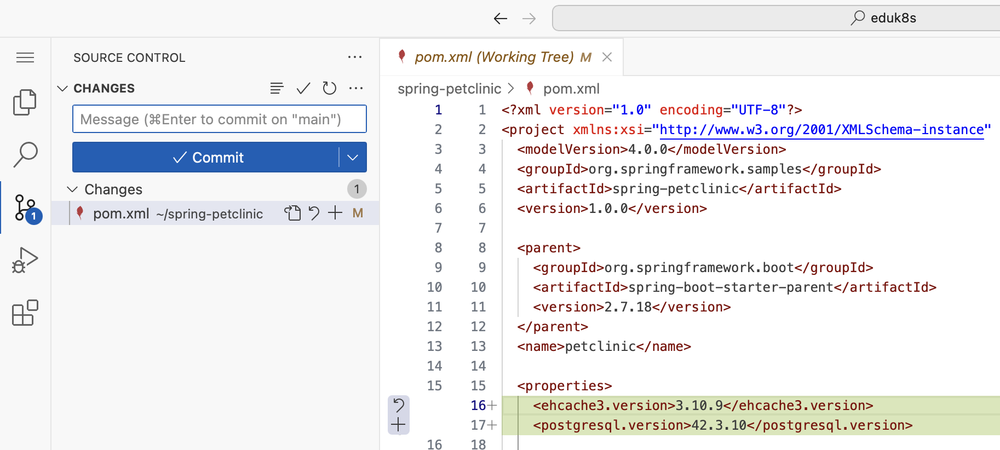
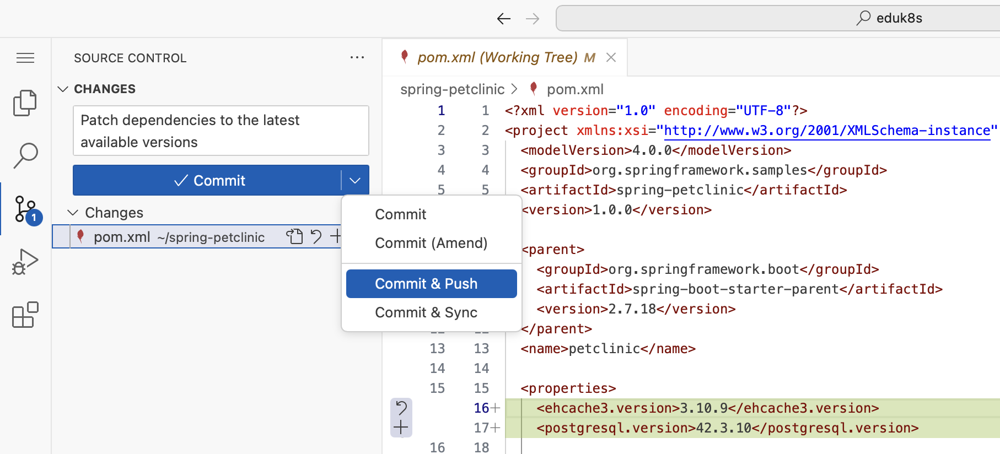

Before we start the (much bigger) journey of upgrading to a new Spring Boot minor or major version, let's get the quickest win first, **applying the latest patch versions** of all the dependencies our application already uses.

Our sample application shows exactly where the problem starts. *Spring Boot 2.7* reached its **open source end of support in 11/2023**, so no new open source patch releases are published for it or for the dependency versions it manages. Known vulnerabilities in those libraries simply stay open until the full Spring Boot 4.x upgrade is finished. This is where a *[VMware Tanzu Spring](https://enterprise.spring.io/lts-releases)* subscription helps. It gives you access to the **Spring Enterprise Repository** with commercial patch and hotfix releases that contain the security fixes for versions which are out of open source support.

The `advisor patch apply` command calculates the latest patch versions for all the dependencies in the Software Bill of Materials (SBOM) of our application and applies them to the `pom.xml` (or `build.gradle`) files. It stays **within the same minor version**, so it is a low-risk change that:
- Updates explicit dependency versions
- Refreshes the parent project version
- Modifies transitive dependencies and adds new transitive dependencies when patch versions become available
- Updates imported SBOM dependency versions while removing redundant libraries

Combined with the commercial releases of a *VMware Tanzu Spring* subscription, the command becomes really valuable. It also moves the *Spring Boot 2.7* parent and its managed dependencies to commercial patch and hotfix versions, which means we can close known vulnerabilities today, without waiting for the upgrade to Spring Boot 3.x.


For this workshop, the **Spring Enterprise Repository with the commercial releases is not configured**. *Spring Application Advisor* is therefore only able to patch and pin the libraries that have newer versions available in open source which are compatible with *Spring Boot 2.7.18*.

In your own environment, you configure the access to the Spring Enterprise Repository in your Maven `settings.xml` or your Gradle build. For Gradle setups with internal-only repositories, the environment variables `ADVISOR_DEFAULT_OSS_PLUGINS_REPOSITORY`, `ADVISOR_DEFAULT_OSS_PLUGINS_USERNAME`, and `ADVISOR_DEFAULT_OSS_PLUGINS_PASSWORD` have to be set as well.


Let's look at the available options first.
```execute
advisor patch apply --help
```

Some important options to be aware of:
- `--push`: Automatically creates a remote branch, pushes the changes, and opens a pull request
- `--from-yml`: Reads the configuration from an `.advisor.yml` file in the repository root
- `--scm-host`: The hostname of a self-hosted Git server like GitLab or GitHub Enterprise

We will get back to `--push` and `--from-yml` in the section about continuous upgrades at the end of this workshop. For now, we run the patch locally.

Let's patch our application!
```execute
advisor patch apply
```


This command queries the Maven repositories for every single dependency of our application, which is why it usually takes a few minutes. This is another reason why it is a perfect fit for a scheduled CI/CD pipeline.


Once it has finished, the CLI lists all the upgraded dependencies grouped by scope (compile, provided, runtime, test) with their version transitions and prints a summary like `🚀 Patch apply complete: 12 dependency(-ies) upgraded in 1 file(s).` As expected, the *Spring Boot 2.7* parent version is left untouched.

We can discover the changes made to our code base with the Git CLI.
```execute
git status
git --no-pager diff pom.xml
``` 


As an alternative, we can use the *Source Control* view of the Visual Studio Code editor in the workshop environment.
```editor:execute-command
command: workbench.view.scm
description: Open the "Source Control" view in editor
```

In the *Source Control* view, click on the files listed under *Changes* (in our case only `pom.xml`) to see the details.


#### Ignoring dependency patch version upgrades

Sometimes a dependency must stay exactly where it is, for example because it is pinned by a downstream system, certified in a specific version, or known to break in a newer patch release. For those cases, the `.advisor.yml` file in the repository root supports a **Dependabot-style `ignore` block** that excludes dependencies from `advisor patch apply` (and its `cf repo patch-apply` equivalent).

Each entry targets a dependency by its `group:artifact` coordinate and optionally restricts which versions are excluded, using the same syntax as Dependabot's ignore configuration.

Ignore a dependency entirely:
```yaml
ignore:
  - dependency-name: "com.example:pinned-lib"
```

Ignore specific version ranges:
```yaml
ignore:
  - dependency-name: "org.springframework.boot"
    versions: ["3.x"]
```

Ignore all artifacts from a group with a wildcard:
```yaml
ignore:
  - dependency-name: "com.acme:*"
```

These entries can be combined in a single `ignore` block. Ignored dependencies are left at their current version and reported separately from the upgraded dependencies in the `advisor patch apply` summary.

Because patching stays within the same minor version, no source code changes are required. Let's still validate that our application works as expected by running the tests.
```terminal:execute
command: ./mvnw compile
session: 2
```

Let's commit and push the changes before we move on to our upgrade plan.
```editor:execute-command
command: workbench.view.scm
description: Open the "Source Control" view in editor
```
To do this, enter a commit message like `Patch dependencies to the latest available versions` in the *Message* field, click on the down arrow on the right of the commit button and select *Commit & Push*.
